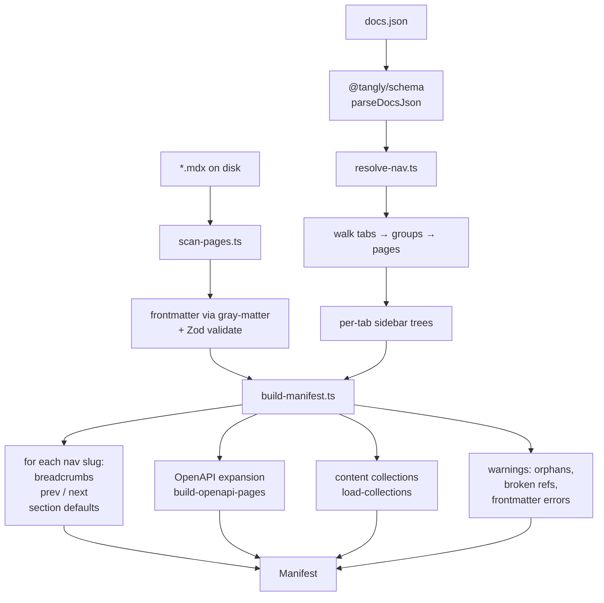

# Manifest builder

`packages/tangly/src/manifest/` reads `docs.json` and the MDX files in your project, then produces a single typed `Manifest` object that the runtime consumes for every page render.

## Data flow



## Shape

```ts
interface Manifest {
  config: DocsJson;
  pages: Map<string, PageEntry>;
  navigation: ResolvedNavigation;
  orphans: string[];
  warnings: ManifestWarning[];
  collections?: Record<string, unknown[]>;
  root: string;
}
```

`PageEntry` carries everything a page render needs:

```ts
interface PageEntry {
  slug: string;
  file: string;
  frontmatter: Frontmatter;
  breadcrumbs: { title: string; slug?: string }[];
  sidebar: SidebarItem[];
  tab?: { slug: string; title: string };
  prev?: { slug: string; title: string };
  next?: { slug: string; title: string };
  draft: boolean;
  blocks?: Record<string, string>;  // for <Embed>
}
```

## The three steps

<Steps>
  <Step title="scan-pages.ts">
    Walks the project root recursively, reads MDX frontmatter via `gray-matter`, validates against the Zod frontmatter schema. Skips: `node_modules`, `dist`, `.tangly`, `components/`, `templates/`, hidden dirs, files starting with `_` (those are section-default sources, surfaced separately).
  </Step>
  <Step title="resolve-nav.ts">
    Walks the recursive nav tree (tabs → groups → pages, plus anchors and dropdowns). Computes per-tab sidebars and collects all referenced slugs. Recursive — groups can nest arbitrarily deep.
  </Step>
  <Step title="build-manifest.ts">
    Stitches the two together. For each nav slug, resolves [section defaults](/guides/configuration#section-defaults) by walking outward to find `_section.mdx` / `_meta.json`, computes breadcrumbs + prev/next from the flat sidebar order, and extracts named blocks for `<Embed>`. Reports orphans (MDX files on disk not in nav) and surfaces them as routable but un-linked.
  </Step>
</Steps>

## OpenAPI expansion

When `docs.json` declares an OpenAPI spec at the tab level:

```json
{
  "tab": "API",
  "openapi": "https://api.example.com/openapi.json"
}
```

`build-openapi-pages.ts` fetches the spec, generates one synthetic `PageEntry` per operation, and appends them to the tab's sidebar. The catch-all renders these via `<OpenApiEndpoint>` instead of MDX.

## Content collections

If the user ships a `tangly.config.ts` with `defineCollections({ ... })`, those collection sources are loaded, validated against their Zod schemas, and serialized into `manifest.collections`. The runtime exposes them via `virtual:tangly/manifest`.

## Warnings

The manifest never throws on user-content issues — it collects them as `warnings: ManifestWarning[]`:

- Frontmatter validation errors (per file).
- Nav references with no MDX file on disk.
- Unsupported nav node shapes.
- Failed OpenAPI fetch / parse.
- Collection schema violations.

The CLI surfaces these via `tangly dev`'s startup banner and `tangly check`.
