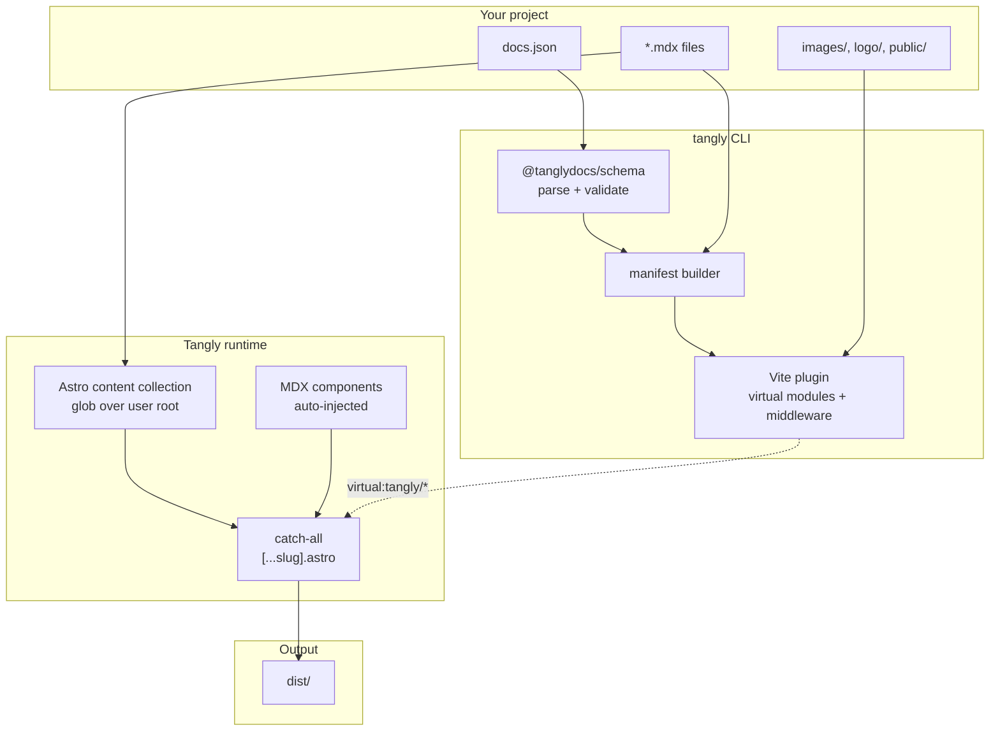

# Architecture

Tangly is a thin layer over Astro 6. Your project is `docs.json` + `*.mdx`; Tangly synthesizes an Astro app, loads your content via virtual modules, and renders prerendered HTML through a single catch-all route.

## High-level flow

The flow is one-directional: parse → manifest → expose → render → emit. Dev mode watches the user directory and re-emits virtual modules on change; build mode runs once.

## Three packages

<CardGroup cols={3}>
  <Card title="@tanglydocs/schema" icon="shield">
    Zod schema for `docs.json`, frontmatter validator, mint.json migrator. Generates JSON Schema for editor support.
  </Card>
  <Card title="tangly" icon="terminal">
    CLI commands, manifest builder, Vite plugin, and the synthesized Astro app shipped under `runtime/`.
  </Card>
  <Card title="@tanglydocs/theme-ui" icon="palette">
    Layout, Sidebar, TopNav, Footer, PageShell, plus the MDX component set. Two consumer themes (`tang`, `pith`) wire it up with their own CSS.
  </Card>
</CardGroup>

## Key design decisions

<Note>
  **User repos never see Astro.** Tangly runs Astro programmatically with `root` pointing at our shipped `runtime/`. Your project only contains `docs.json` + MDX. `tangly eject` materializes the runtime into your repo when you want to leave.
</Note>

<Note>
  **Content collections + glob loader** point at your project root via `TANGLY_USER_ROOT`. Astro handles MDX parsing, HMR, asset processing, and static generation natively. Tangly does not reinvent any of it.
</Note>

<Note>
  **Virtual modules** carry runtime state. The manifest is computed once per dev session and re-imported via `virtual:tangly/manifest` from any page. Chokidar invalidates it on `docs.json` or `.mdx` changes.
</Note>

<Note>
  **Component shadowing** resolves bottom-up: project `theme/<Name>.astro` → active theme → built-in default. The Astro integration sets up Vite aliases so `@tanglydocs/theme-ui/Card.astro` transparently resolves to whatever the user has overridden.
</Note>

## Performance targets

- Cold dev start: under 2s for 100 pages.
- HMR: under 250ms.
- Build: under 30s for 100 pages.

These are acceptance criteria, not aspirations. Profile before merging if anything regresses.

## Read more

<CardGroup cols={2}>
  <Card title="Manifest builder" icon="git-branch" href="/architecture/manifest">
    Page scan, nav resolve, prev/next, breadcrumbs.
  </Card>
  <Card title="Vite plugin" icon="zap" href="/architecture/vite-plugin">
    Virtual modules, HMR, static-asset middleware, MDX preprocessing.
  </Card>
  <Card title="Runtime" icon="cog" href="/architecture/runtime">
    The Astro app shipped inside `tangly`.
  </Card>
</CardGroup>
