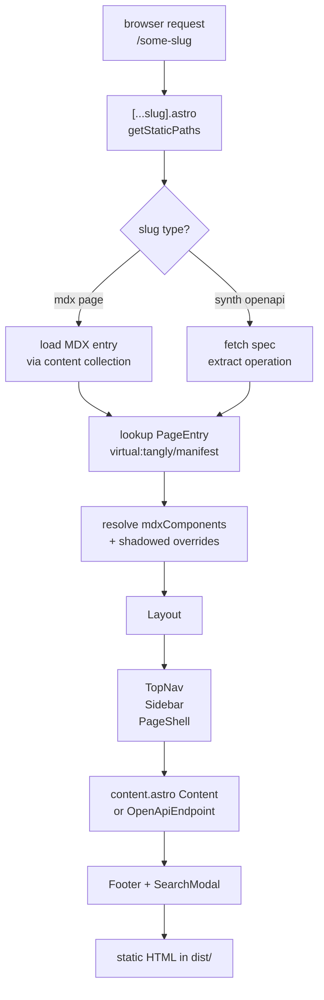

# Runtime

`packages/tangly/runtime/` is a real Astro project that ships inside the `tangly` npm package. The CLI invokes `astro dev` / `astro build` programmatically with `root` pointing at this directory.

## Layout

<FileTree>
- runtime/
  - astro.config.mjs remark/rehype pipeline, MDX, Tailwind, adapter
  - src/
    - content.config.ts collection: glob over `<userRoot>/**/*.mdx`
    - pages/
      - index.astro redirects to first nav page
      - `[...slug].astro` catch-all, renders any page slug
    - lib/
      - mdx-components.ts injects Note/Card/Tabs/etc. into MDX
      - remark-mintlify-compat.mjs
      - remark-explicit-ids.mjs
      - remark-mermaid.mjs
</FileTree>

## Page render pipeline



## Catch-all in detail

`src/pages/[...slug].astro` is the heart of the runtime. For each request:

<Steps>
  <Step title="getStaticPaths">
    Reads `getCollection('docs')` (Astro's content layer) and returns one path per MDX entry, plus one per OpenAPI synth page from `manifest.pages`. All routes prerendered.
  </Step>
  <Step title="Resolve PageEntry">
    Looks up the entry in `virtual:tangly/manifest` to get nav/sidebar/breadcrumb context. Falls back to a synthesized "orphan" entry for pages on disk but not in nav.
  </Step>
  <Step title="OpenAPI handling">
    If frontmatter has `openapi: METHOD path` or the page is a synth endpoint, fetches the spec and renders via `<OpenApiEndpoint>` (or a third-party viewer if `api.viewer` is `scalar` / `redoc` / `stoplight`).
  </Step>
  <Step title="Render">
    Wraps content in `Layout` + `PageShell`, passes `mdxComponents` into `<Content components={...} />`. The Tangly Astro integration has already aliased every component import so user overrides at `<userRoot>/theme/<Name>.astro` intercept transparently.
  </Step>
</Steps>

## Content collection

```ts
const docs = defineCollection({
  loader: glob({
    base: process.env.TANGLY_USER_ROOT,
    pattern: ["**/*.mdx", "!**/_*.mdx", "!snippets/**", "!components/**", "!templates/**"],
  }),
});
```

Astro's content layer handles MDX parsing, image processing, and per-file caching. We don't reinvent any of it.

## Why a runtime, not a config preset

We could ship as `astro.config` snippets the user adds. Instead, the runtime is fully synthesized:

- User repo never needs Astro deps.
- `tangly eject` materializes this directory into the user's repo and removes `tangly` from deps when you want to leave.
- We can iterate runtime internals without breaking user code.

## Discovery

`getRuntimeDir()` finds the runtime by walking up from the CLI's compiled JS until it finds a directory with `astro.config.mjs`. This handles npm install + workspace symlinks transparently.

## Adapter selection

`astro.config.mjs` reads `TANGLY_ADAPTER` (set by the CLI from `--adapter` or auto-detect). Today only `vercel` applies a real adapter; `cloudflare` and `node` are recognized but stay static-only until SSR routes (e.g. AI chat) land. See [Deploying](/guides/deploying) for the matrix.
