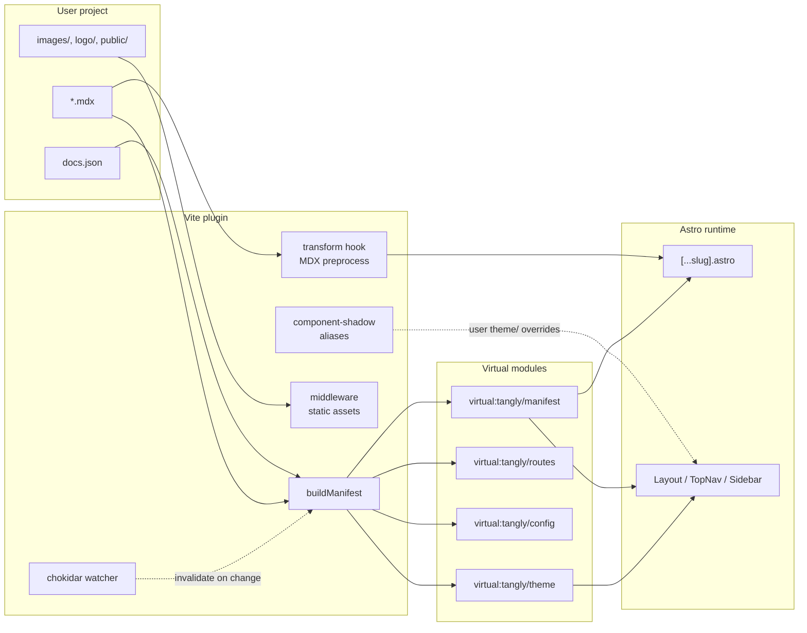

# Vite plugin

`packages/tangly/src/plugin/vite-plugin.ts` is the bridge between user state (the manifest, theme, config) and the synthesized Astro runtime.

## Module graph



## Virtual modules

Four virtual imports are exposed to the runtime:

| ID                        | Exports                                                                             |
| ------------------------- | ----------------------------------------------------------------------------------- |
| `virtual:tangly/manifest` | The full `Manifest` (config, pages, navigation, orphans, warnings, collections)     |
| `virtual:tangly/routes`   | `[{ slug, file }]` for each page (drafts excluded in build mode)                    |
| `virtual:tangly/config`   | The parsed `DocsJson`                                                               |
| `virtual:tangly/theme`    | `{ themeName, userRoot }` — used by Layout to pick the active theme's CSS           |

Any `.astro` file in the runtime can `import { manifest } from "virtual:tangly/manifest"` and get a typed snapshot.

## Hot reload

A chokidar watcher listens for changes in:

- `<userRoot>/docs.json`
- `<userRoot>/**/*.mdx`
- `<userRoot>/**/*.md`
- `<userRoot>/tangly.config.ts`
- `<userRoot>/_section.mdx` and `<userRoot>/**/_meta.json`

On change, the manifest is invalidated, virtual modules are re-evaluated, and Vite is told to do a full reload via `server.ws.send({ type: 'full-reload' })`. Astro's MDX HMR handles per-page MDX changes natively for sub-page edits.

## Static-asset middleware

Mintlify projects use absolute paths for images: ``. Tangly's middleware resolves these against the user root's matching directory:

```
GET /images/foo.png  →  <userRoot>/images/foo.png
GET /logo/dark.svg   →  <userRoot>/logo/dark.svg
GET /favicon.ico     →  <userRoot>/<config.favicon>
```

Supported prefixes: `images`, `logo`, `public`, `static`, `assets`. Path traversal is blocked — requests like `/images/../../etc/passwd` are rejected before any I/O.

## Build-time variant

In production, `packages/tangly/src/build-outputs/copy-assets.ts` walks the same set of directories and copies them into `dist/` so deployed pages see the same paths the dev server served.

## MDX preprocess

The plugin's `transform()` hook rewrites Mintlify-only quirks before MDX parses JSX:

- `<latex>...</latex>` → `$$...$$` block math (so curly-brace LaTeX doesn't trigger MDX expression parsing).
- Relative Markdown image refs (``) → absolute paths (`/images/foo`) so Astro's asset pipeline doesn't mis-resolve them in nested routes.

More compatibility shims land here as we hit them.

## Component shadowing

`packages/tangly/src/plugin/component-shadow.ts` rewrites Vite resolution for `@tangly/theme-ui/<Name>.astro`:

1. `<userRoot>/theme/<Name>.{astro,tsx,jsx}` (project-level override)
2. `@tangly/theme-<active>/components/<Name>.astro` (theme-level override)
3. `@tangly/theme-ui/components/<Name>.astro` (built-in default)

The lookup runs at module-resolution time, not import time, so overrides have zero runtime cost — Vite produces the same code as if you'd written the import directly.
