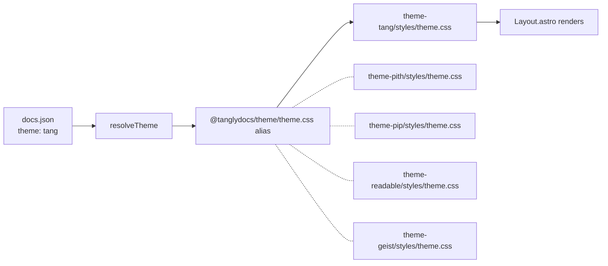

# `theme`

Sets the active theme. Schema reference. For a tour of each theme with screenshots and palette tokens, see the [Themes guide](/guides/themes/index).

```json
{ "theme": "tang" }
```

## Accepted values

Five canonical names:

| Value | Package | Description |
|---|---|---|
| `tang` | `@tanglydocs/theme-tang` | Default. Mintlify-Mint inspired. |
| `pith` | `@tanglydocs/theme-pith` | Editorial. Serif headings, cream background. |
| `pip` | `@tanglydocs/theme-pip` | Minimal. Topbar-only chrome for tiny sites. |
| `readable` | `@tanglydocs/theme-readable` | Reader-mode. Cream paper, serif body, book-style chapter nav. |
| `geist` | `@tanglydocs/theme-geist` | Modern dev-tool aesthetic (Vercel/Linear/Stripe family). |

The Zod schema is `z.enum(TANGLY_THEMES).or(z.string())` — unknown strings are accepted at parse time so projects mid-migration don't fail validation. They fall through to `tang` at render via `resolveTheme()`.

## Mintlify aliases

Existing Mintlify projects often have one of these in `docs.json#theme`:

`mint` · `maple` · `palm` · `willow` · `linden` · `almond` · `aspen` · `luma` · `sequoia`

All resolve to `tang`. See the [aliases page](/guides/themes/aliases) for the rationale.

```ts
import { resolveTheme } from "@tanglydocs/schema";

resolveTheme("mint");      // "tang"
resolveTheme("pith");      // "pith"
resolveTheme(undefined);   // "tang"
```

`tangly migrate` does **not** auto-rewrite legacy values — it surfaces a notice so you pick a Tangly theme explicitly.

## How themes resolve

The Tangly Astro integration sets up a Vite alias for `@tanglydocs/theme` that points at the active theme's `theme.css`. Components (Layout, TopNav, Sidebar, etc.) live in `@tanglydocs/theme-ui` and are shared across all themes; per-theme styling and color tokens are CSS-only.



## Project-level overrides

Drop a `theme/styles/theme.css` at your project root to override the active theme's CSS:

```
my-docs/
├── docs.json
└── theme/
    └── styles/
        └── theme.css   # your overrides — concatenated after the active theme
```

The integration's alias resolves project-level files first, falling back to the bundled theme. See [Customizing themes](/guides/themes/customizing).

## Source

- Zod schema: [`packages/schema/src/themes.ts`](https://github.com/tanglydocs/tangly/blob/main/packages/schema/src/themes.ts)
- Each theme's tokens: [`packages/theme-{tang,pith,pip,readable,geist}/src/styles/theme.css`](https://github.com/tanglydocs/tangly/tree/main/packages)
