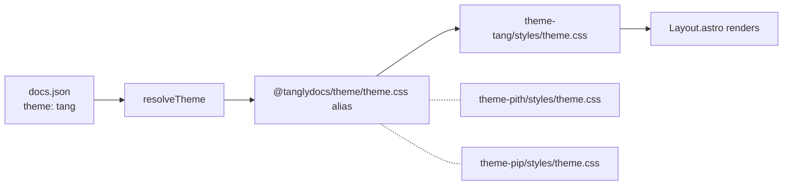

# Themes

Tangly ships four themes:

| Name | Description |
| ---- | ----------- |
| `tang` | Default. Mintlify-Mint inspired. Sans-serif headings, white background, sidebar to the left. |
| `pith` | Editorial. Serif headings, cream background, narrower main column. |
| `pip` | Compact. Minimal chrome, dense sidebar. Used for Tangly's own docs. |
| `readable` | Long-form reading mode with a scroll progress bar. |

Set the active theme in `docs.json`:

```json
{ "theme": "tang" }
```

## Mintlify theme aliases

Existing Mintlify projects often have one of these in `docs.json#theme`:

`mint` · `maple` · `palm` · `willow` · `linden` · `almond` · `aspen` · `luma` · `sequoia`

Tangly's `parseDocsJson` accepts any string for `theme` so projects mid-migration don't fail validation. Unknown values fall through to `tang` at render time via the `resolveTheme` helper:

```ts
import { resolveTheme } from "@tanglydocs/schema";

resolveTheme("mint");      // "tang"
resolveTheme("pith");      // "pith"
resolveTheme(undefined);   // "tang"
```

`tangly migrate` does **not** auto-rewrite legacy values — it surfaces a notice so you pick a Tangly theme explicitly.

## How themes resolve

The Tangly Astro integration sets up a Vite alias for `@tanglydocs/theme` that points at the active theme's `theme.css`. Theme components (Layout, TopNav, Sidebar, etc.) live in `@tanglydocs/theme-ui` and are shared across all themes; per-theme styling and color tokens are CSS-only.



## Project-level theme override

Drop a `theme/styles/theme.css` at your project root to override the active theme's CSS:

```
my-docs/
├── docs.json
└── theme/
    └── styles/
        └── theme.css   # your overrides — concatenated after the active theme
```

The integration's alias resolves project-level files first, falling back to the bundled theme.

## Customizing a theme

Third-party theme packages aren't a supported extension point yet — `theme:` only resolves the four built-in names. The recommended path:

1. Set `theme:` to whichever built-in ships closest to your design.
2. Override at the project level via `theme/styles/theme.css` (CSS variables) and shadowed components.

See [Custom components](/guides/custom-components) for shadowing details.
